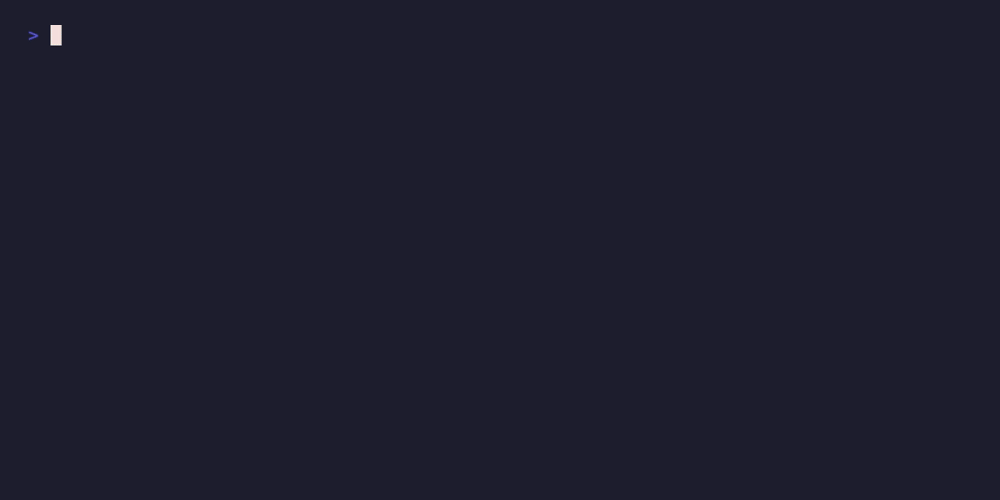

# augur

**Graded trust for changes.** A deterministic change-risk verdict for every diff: `proceed`,
`review`, or `block`. No API key, no LLM.

[](https://corvidlabs.github.io/augur/)
[](https://github.com/CorvidLabs/augur/actions/workflows/ci.yml)
[](https://corvidlabs.github.io/augur/)

<p align="center">
  
</p>

`augur` reads a diff and tells you how risky it is, and whether a human should look, as a
deterministic, scriptable verdict: `proceed`, `review`, or `block`. macOS and Linux.

## Quickstart

### Install

The fastest way is Homebrew (macOS); on Linux, build from source (below):

```sh
brew install corvidlabs/tap/augur
```

Prefer to build from source? Drop the release binary on your `PATH` (needs Swift 6 and `git`):

```sh
swift build -c release
install -m 0755 .build/release/augur /usr/local/bin/augur
# or, with fledge:
fledge run install
```

Other options:

```sh
mint install CorvidLabs/augur
# or
swift package experimental-install
```

### Try it instantly (no setup)

Every script in [`examples/`](examples/README.md) builds the binary and runs against a
throwaway `/tmp` repo, so you get a real verdict in seconds:

```sh
bash examples/01-check.sh
```

See [`examples/README.md`](examples/README.md) for the full catalog (gate exit codes,
coverage, SARIF, the `augur → attest` trust loop, and more).

### The core commands

`augur check` reports a verdict over a range (it always exits `0`):

```
$ augur check --range main..HEAD

augur · main..HEAD

  verdict     [!] REVIEW
  risk        [#######             ]  37/100
  confidence  63/100
  calibration prior-only (0 incidents / 7 commits)

  files (2), riskiest first:
    !    36  src/auth/token.swift
          · sensitivity: matches sensitive category 'auth'
    !    35  db/migrations/001_add_secrets.sql
          · sensitivity: matches sensitive category 'secrets'

  → an agent should request human review before merging
```

`augur gate` exits **non-zero** when the verdict meets or exceeds a threshold, so a CI step
or agent escalates instead of merging blind:

```
$ augur gate --range main..HEAD --threshold review
augur gate · review (risk 37)
$ echo $?
1
```

`augur check --json` is the agent-friendly path (sorted-key JSON):

```
$ augur check --range main..HEAD --json | jq .verdict
"review"
```

In human reports, `confidence` is a display inverse of risk (`100 - riskScore`).
The engine's primary output is still `riskScore` plus the derived verdict; the
separate `calibration.confidence` field only says how much history backs the
incident signal.

### Where next

- [Docs site](https://corvidlabs.github.io/augur/): the rendered guides.
- [`docs/cli.md`](docs/cli.md): every command, flag, exit code, and the JSON shape.
- [`docs/configuration.md`](docs/configuration.md): the full `.augur.toml` reference.
- [`examples/README.md`](examples/README.md): every runnable example, simplest first.

## Why it exists

It's built for the world where agents write most of the code: humans can't hand-review the
volume, and agents have no native sense of "I'm out of my depth here, escalate." `augur` is
that missing primitive. It's language-agnostic, CI-agnostic, and **requires no API key and no
LLM**. AI is optional and additive.

Agents made code cheap to produce. The scarce resource is now *trust*. `augur` turns the
senior-engineer instinct ("this part is fine, that part needs a careful look") into a
deterministic artifact that both humans and agents can act on.

- **Humans** use it to triage: spend review attention on the risky 10% of a 40-file PR.
- **Agents** use it to gate: `augur gate` exits non-zero so an agent escalates instead of
  merging blind.

## How it scores

Every signal is derived from `git` history and the filesystem. No model, no network:

| Signal | What it catches |
|--------|-----------------|
| **sensitivity** | Touches secrets, auth, crypto, payments, migrations, infra, CI, or dependency manifests. |
| **test-gap** | Code changed with no test in the changeset, *or*, with a coverage report, the fraction of changed lines left uncovered. Never fires on documentation/prose files. |
| **churn** | Hot files that change constantly are fragile. |
| **coupling** | A file's usual co-change partner is *absent* from the change. |
| **diff-shape** | Large single-file edits are harder to review. |
| **ownership** | Bus-factor (single author) or diffuse ownership (many authors). |
| **incident** | The file's own history of reverts / hotfixes. |
| **codeowners** | A changed file with no declared owner in the repo's `CODEOWNERS` (neutral when there is no `CODEOWNERS` file). |

Scoring has two layers:

1. A **transparent heuristic prior** with documented weights. It always applies, even on a
   brand-new repo.
2. A **history calibration** that scales the incident signal by how much the repository's
   own revert/hotfix record backs it. Every assessment reports `calibration`
   (`prior-only` → `weak` → `history-backed`) so you know whether a score is guessing or
   grounded. The longer `augur` watches a repo, the sharper it gets.

The primary score is `riskScore` (`0...100`), and verdict thresholds are applied to that
risk. Human and markdown reports also show `confidence`, but it is just the inverse
(`100 - riskScore`) for readability. Do not confuse that with `calibration.confidence`,
which is the separate `0...1` measure of how much repository history backs the incident
signal.

## Usage

```sh
augur check                         # assess working-tree changes
augur check --range main..HEAD      # assess a range (range-first)
augur check --staged                # assess staged changes (pre-commit)
augur check --json                  # machine-readable, sorted-key JSON
augur check --markdown              # GitHub-flavored markdown (PR comments / job summaries)
augur check --sarif                 # SARIF 2.1.0 for GitHub code scanning
augur check --sarif-out augur.sarif # write SARIF to a file (implies --sarif)
augur check -v                      # show every contributing signal

augur gate --threshold review       # exit 1 if verdict >= review (CI / agent loops)
augur explain                       # optional AI explanation via fledge

augur calibrate                     # cache the history model to .augur/cache.json
augur check --cached                # reuse the cache instead of re-walking git log

augur check --config ./my.toml      # use an explicit .augur.toml
augur check --no-config             # ignore any .augur.toml; use built-in defaults

augur check --coverage lcov.info    # sharpen test-gap with a coverage report (LCOV/Cobertura/JaCoCo/Go)
augur check --no-coverage           # disable coverage auto-detection

augur check --exclude 'vendor/**'   # drop vendored/generated paths from the assessment (repeatable)
augur check --no-exclude            # ignore [exclude] paths from .augur.toml

augur check --no-codeowners         # disable CODEOWNERS-aware ownership scoring

augur check --color auto            # color when stdout is a TTY (default)
augur check --color always          # force color (e.g. for screenshots / pagers)
augur check --color never           # plain output
```

### Output & color (`--color`, `NO_COLOR`)

The human-readable `check` report is colorized **only when it's safe**: by default
(`--color auto`) color is emitted only when stdout is an interactive terminal *and* the
[`NO_COLOR`](https://no-color.org) environment variable is unset. Piped, redirected,
`--json`, and `--sarif` output is always plain, so scripts and CI capture clean text.
Use `--color always` to force it (handy for screenshots) or `--color never` to disable it.

The color scheme is semantic and intentionally restrained:

- **Verdict:** `proceed` green, `review` amber/yellow, `block` bold red.
- **Risk meter:** a `█`/`░` gradient bar tinted by level (green → amber → red).
- **Headers / labels:** bold; secondary and signal detail are dim/gray.
- **File paths:** cyan; each per-file row is tinted by that file's own verdict.
- **Confidence & calibration:** cyan.

### Coverage-aware test-gap (`--coverage`)

By default the **test-gap** signal is a coarse heuristic: did the changeset touch any
test file? Supply a line-coverage report and it becomes precise. It scores the fraction
of the change's *added* lines that are actually covered:

```sh
augur check --coverage lcov.info      # LCOV
augur check --coverage coverage.xml   # Cobertura XML
augur check --coverage jacoco.xml     # JaCoCo XML (Kotlin/Java)
augur check --coverage cover.out      # Go coverprofile (go test -coverprofile)
```

Four formats are supported, all parsed in `AugurKit` with Foundation only (no third-party
dependency):

| Format | Typical name | How a line is instrumented / covered |
|--------|--------------|--------------------------------------|
| **LCOV** | `lcov.info` | `DA:<line>,<hits>`. Covered when `hits > 0`. |
| **Cobertura** | `coverage.xml` | `<line number hits>`. Covered when `hits > 0`. |
| **JaCoCo** | `jacoco.xml` | `<line nr mi ci>` under `<package><sourcefile>`. Covered when `ci` (covered instructions) `> 0`; path is `package@name`/`sourcefile@name`. |
| **Go coverprofile** | `cover.out` | `path:start.col,end.col stmts count` blocks; every line in `start…end`. Covered when *any* covering block has `count > 0`. |

augur also **auto-detects** a report at the repo root when `--coverage` is absent, trying these
names in order and using the **first** that exists (logged to stderr): `lcov.info`,
`coverage.xml`, `jacoco.xml`, `cover.out`, `coverage.out`. Pass `--no-coverage` to disable
that, or `--coverage <path>` to point elsewhere. The format is detected by extension (`.info`
→ LCOV, `.out` → Go, `.xml` → Cobertura/JaCoCo) then by content (JaCoCo is distinguished from
Cobertura by its `<report>`/`<sourcefile>` markers; a Go profile by its leading `mode:` line).

Precise behavior, per non-test, non-binary code file:

- **Has instrumented changed lines** → `risk = 1 − (covered ÷ instrumented)`, with a detail
  like `2/3 changed lines covered (67%)`.
- **Entirely absent from the report** → high risk (`0.7`, "not in coverage report").
- **No changed line was instrumented** (e.g. only comments/blank lines changed), or no
  per-line data is available → falls back to the heuristic.
- **No coverage supplied at all** → the original heuristic test-gap behavior, unchanged.

Added line ranges come from `git diff --unified=0`; only the file's *added* lines are scored
(not context or deletions).

**Path-matching limitation.** Diff paths and coverage paths often disagree on a leading
prefix (`Sources/App/Service.swift` vs `/build/checkout/Sources/App/Service.swift`), so
augur matches by **normalized longest common suffix** at path-component boundaries. This
tolerates prefix differences, but if two distinct files share an identical trailing suffix
(`a/util.swift` and `b/util.swift` against a bare `util.swift`) the match is ambiguous and
resolved deterministically (shorter then lexicographically-smaller path), so it may not be the
file you intended. Prefer emitting coverage with repo-relative paths.

### SARIF for GitHub code scanning (`--sarif`)

`augur check --sarif` emits a [SARIF 2.1.0](https://docs.oasis-open.org/sarif/sarif/v2.1.0/sarif-v2.1.0.html)
log so augur's risk findings can be uploaded to GitHub code scanning and annotate a pull
request **inline**: each changed file gets an annotation at its first added line.

```sh
augur check --range main..HEAD --sarif                  # SARIF to stdout
augur check --range main..HEAD --sarif-out augur.sarif  # SARIF to a file
```

`--sarif` and `--json` are mutually exclusive; `--sarif-out <path>` implies `--sarif`. The
output is generated entirely in `AugurKit` with Foundation `Codable` (no third-party SARIF
dependency) and is deterministic (sorted keys).

augur emits a **single** rule, `augur/change-risk`, and **one result per assessed file**.
Each result's severity `level` is mapped from the file's verdict:

| Verdict | SARIF level |
|---------|-------------|
| `block` | `error` |
| `review` | `warning` |
| `proceed` | `note` |

The `message.text` summarizes the verdict, risk score, and top contributing signals; the
location points at the file with a `region.startLine` of its first added line (when added
lines are known); and `riskScore` / derived `confidence` (`100 - riskScore`) / `verdict`
are carried in `result.properties`.

A runnable end-to-end demo is in [`examples/07-sarif.sh`](examples/07-sarif.sh), and a
copy-paste CI workflow that uploads the SARIF is in
[`examples/workflows/sarif.yml`](examples/workflows/sarif.yml):

```yaml
- run: augur check --range "origin/${{ github.base_ref }}..HEAD" --sarif --sarif-out augur.sarif
- uses: github/codeql-action/upload-sarif@v3
  with:
    sarif_file: augur.sarif
    category: augur
```

**Honest caveat (GHAS on private repos).** Uploading SARIF to GitHub code scanning via
`github/codeql-action/upload-sarif` requires **GitHub Advanced Security (GHAS)** when the
repository is **private**; without it the upload step returns a `403`. It works out of the
box once the repo is **public**, or with GHAS enabled on a private repo. The example
workflow marks the upload `continue-on-error: true` so the job stays green until GHAS/public
is in place; remove that once it is. Generating the SARIF file itself needs nothing special.

### Configuration (`.augur.toml`)

Drop an `.augur.toml` at the repo root and `augur` discovers it automatically (override
with `--config <path>`, ignore with `--no-config`). Every section is optional; an absent
file means built-in defaults, so configuration is strictly additive. It is parsed in the
CLI layer only; the engine library stays dependency-free.

```toml
# Verdict cutoffs (0...100). score >= block -> block; >= review -> review; else proceed.
# Defaults: review = 35, block = 65.
[thresholds]
review = 35
block = 65

# Signal weights for the heuristic prior. Only listed keys are overridden.
[weights]
sensitivity = 0.25
test_gap = 0.20
codeowners = 0.08   # weight of the CODEOWNERS ownership signal

# Set true to use ONLY the custom rules below; default false MERGES them onto the built-ins.
[sensitivity]
replace_defaults = false

# Custom sensitivity rules: flag paths containing any fragment with the given risk (0...1).
[[rules]]
label = "internal-api"
risk = 0.7
fragments = ["internal/", "private/"]

# Drop generated/vendored/lockfile paths from the assessment entirely (glob-matched).
[exclude]
paths = ["vendor/**", "node_modules/**", "**/*.generated.swift", "**/Package.resolved"]
```

A worked, commented config and runnable scripts live in [`examples/`](examples/).

### Excluding generated & vendored files (`[exclude]` / `--exclude`)

Vendored dependencies, generated code, and lockfiles add noise to a risk verdict. A
9,000-line `vendor/` drop or a churny `Package.resolved` is not something a reviewer
should be scored on. List globs under `[exclude] paths` (or pass `--exclude <glob>`,
repeatable) and `augur` removes matching files **before** scoring: they appear in neither
the verdict nor any signal, and are reported as `excluded: N files` (and in JSON's
`excludedPaths`). If *every* changed file is excluded, `augur` treats the change as clean.

Globs are whole-path anchored and support three wildcards:

| Token | Matches | Example |
|-------|---------|---------|
| `*`   | any characters **except** `/` (one path segment) | `src/*.swift` → `src/a.swift`, not `src/x/a.swift` |
| `**`  | any characters **including** `/` (zero or more segments) | `vendor/**` → `vendor`, `vendor/a/b.c` |
| `?`   | exactly one character | `file?.txt` → `file1.txt`, not `file.txt` |

```sh
augur check --exclude 'vendor/**'                 # vendored dependencies
augur check --exclude '**/*.generated.swift'      # generated sources, anywhere
augur check --exclude '**/Package.resolved'       # lockfiles
augur check --exclude 'vendor/**' --exclude 'node_modules/**'  # repeatable

augur check --no-exclude    # ignore [exclude] from .augur.toml (ad-hoc --exclude still applies)
```

CLI `--exclude` globs are *added* to any `[exclude] paths` from `.augur.toml`; `--no-exclude`
drops the configured ones while keeping any passed on the command line.

### CODEOWNERS-aware ownership (`codeowners`)

If your repo has a `CODEOWNERS` file, `augur` uses it to flag review-routing gaps. A changed
file with **no declared owner** raises the `codeowners` signal (risk `0.6`, "no CODEOWNERS
owner"); an **owned** file neutralizes it (risk `0`, detail lists the owners). When there is
**no `CODEOWNERS` file at all**, the signal contributes `0`; repos without one are never
penalized.

`augur` auto-discovers `CODEOWNERS` at the standard locations (`.github/CODEOWNERS`,
`CODEOWNERS`, `docs/CODEOWNERS`; first found wins) and follows GitHub semantics (**the last
matching pattern wins**), reusing the same glob engine as `--exclude`:

```text
# .github/CODEOWNERS
*            @platform        # catch-all
/src/        @backend-team    # overrides for src/
/src/auth/   @security        # overrides again, more specific
*.md         @docs-team
```

The owner is surfaced in the signal detail (human `-v` output and JSON). Pass
`--no-codeowners` to disable, or tune its weight via `.augur.toml [weights] codeowners`.

### Calibrate & cache

`augur calibrate` walks git history once and writes a serializable model to
`.augur/cache.json` (pinned to the current `HEAD`), reporting the backing volume and
calibration band. `augur check --cached` then reuses that model instead of re-running
`git log`, which is ideal for tight agent loops. If `HEAD` has moved since calibration, `check
--cached` prints a staleness warning to stderr but stays usable; with no cache it falls
back to live computation. `.augur/` is git-ignored and never committed.

```sh
augur calibrate           # -> .augur/cache.json (HEAD-pinned)
augur check --cached      # fast path; warns on stderr if stale
```

### In CI

```yaml
- run: augur gate --range origin/main..HEAD --threshold block
```

#### GitHub Action (`CorvidLabs/augur`)

This repo ships a composite GitHub Action ("augur gate") you can drop into **any** repo. It
installs a prebuilt `augur` for the runner (macOS universal or Linux x86_64) from the matching
release, then runs `augur gate` against your checkout — no Swift toolchain required. On other
platforms it falls back to building augur from its own source (which needs Swift on the runner).

```yaml
jobs:
  gate:
    runs-on: ubuntu-latest        # or macos-latest
    steps:
      - uses: actions/checkout@v4
        with: { fetch-depth: 0 }  # gate needs history for the range
      - uses: CorvidLabs/augur@v0
        with:
          range: origin/main..HEAD
          threshold: block
          coverage: lcov.info       # optional
```

Pin to the moving `@v0` tag to track the latest 0.x release, or to an exact tag
(e.g. `@v0.3.0`) to lock a specific version.

| Input | Default | Description |
|-------|---------|-------------|
| `range` | `origin/main..HEAD` | Git range to assess (needs full history). |
| `threshold` | `block` | Fail at or above this verdict (`proceed` / `review` / `block`). |
| `coverage` | *(none)* | Optional path to a coverage report (LCOV `.info`, Cobertura/JaCoCo `.xml`, or Go `.out` coverprofile). |
| `working-directory` | `.` | Repository root to run in. |
| `version` | *(action ref)* | augur release to install (`v0.3.0` or `latest`); defaults to the pinned tag, else `latest`. |

| Output | Description |
|--------|-------------|
| `verdict` | The computed verdict (`proceed` / `review` / `block`). |
| `risk` | The computed risk score (0–100). |
| `binary` | Path to the augur binary used. |

Prebuilt binaries cover **GitHub-hosted macOS and Linux x86_64 runners**. Other runners (e.g.
`windows-latest`, Linux arm64) need a Swift toolchain so the action can build from source.

### For agents

```sh
verdict=$(augur check --range main..HEAD --json | jq -r .verdict)
[ "$verdict" = "proceed" ] || echo "escalating to a human"
```

## JSON shape

```json
{
  "scope": "main..HEAD",
  "riskScore": 45.0,
  "verdict": "review",
  "calibration": { "confidence": 1.0, "totalCommits": 500, "incidentCommits": 156 },
  "thresholds": { "review": 35.0, "block": 65.0 },
  "files": [
    { "path": "src/auth/token.swift", "riskScore": 45.0, "signals": [ /* ... */ ] }
  ],
  "excludedPaths": [ "vendor/lib/huge.swift" ]
}
```

## Development

```sh
fledge run check     # build + test + spec check
fledge run test
fledge run spec      # spec-sync alignment
fledge run selfcheck # dogfood: run augur on its own changes
```

The engine (`AugurKit`) has **zero third-party dependencies** and is fully testable without
`git` via the `RepositoryProbe` protocol. The CLI uses `swift-argument-parser`.

## Trust layer (augur → attest)

A verdict from `augur` is *ephemeral*: it lives for one CI run and is gone. Its sibling
[`attest`](https://github.com/CorvidLabs/attest) makes it durable: `attest` records *who or
what reviewed a change, and at what confidence* as a signed-or-unsigned provenance note
keyed to the commit SHA (stored in git notes), and gates CI / agent loops on a policy.
**augur scores the risk; attest records the trust.** They compose over a pipe and never
link to each other.

```sh
augur check --json | attest sign --from-augur -        # record the trust
attest verify --policy .attest.json                     # gate on it
```

`attest sign --from-augur -` copies augur's `verdict` and maps its `riskScore` (0...100) to
a trust-record confidence (`1 − riskScore/100`). A worked, end-to-end run is in
[`examples/06-trust-pipeline.sh`](examples/06-trust-pipeline.sh): an agent attests a `review`
change, a policy that demands human approval for `review`+ verdicts FAILs, then a human
signs off and it PASSes.
Verified output (real exit codes):

```
== 3) augur check --json | attest sign --from-augur - (agent records trust) ==
attest · recorded agent:claude on f0ec5e6256

== 5) attest verify: agent-only record FAILS the policy ==
  policy: requireHumanApprovalWhenVerdictAtLeast = review
attest verify · [x] FAIL (1 commit checked)
  violations:
    x f0ec5e6256  requireHumanApprovalWhenVerdictAtLeast: verdict is at least review on this commit but no attestation is human-approved
  attest verify -> exit 1   (only an agent attested a 'review' change)

== 6) a human signs off, then attest verify PASSES ==
attest · recorded human:leif on f0ec5e6256
attest verify · [ok] PASS (1 commit checked)
  attest verify -> exit 0   (human approval now satisfies the policy)
```

The policy clears as soon as **any** human-approved attestation exists on the commit: the
human signs off with a plain `--human-approved` and need not restate the verdict.

### Reusable CI workflow

[`examples/workflows/trust.yml`](examples/workflows/trust.yml) is a copy-paste GitHub Actions
workflow other CorvidLabs repos can adopt. On `pull_request` it builds augur and runs
`augur gate --range origin/<base>..HEAD --threshold block`, with commented-out steps showing
exactly where `attest sign` / `attest verify` slot in.

### Pre-commit hook

[`examples/hooks/pre-commit`](examples/hooks/pre-commit) runs `augur gate --staged
--threshold block` and refuses the commit on a `block` verdict (set `AUGUR_THRESHOLD=review`
to also stop on review-grade changes). Install it from the repo root:

```sh
ln -s ../../examples/hooks/pre-commit .git/hooks/pre-commit
# or copy it: install -m 0755 examples/hooks/pre-commit .git/hooks/pre-commit
git commit --no-verify   # deliberately bypass for one commit
```

**Honest scope.** `AugurKit` and the CLI build and run on **macOS and Linux**; CI exercises
both (full build + test on each, via GitHub-hosted runners). Homebrew ships a prebuilt
macOS binary; on Linux, build from source with Swift 6. The dogfooding workflows here
build augur (and attest) *from a checkout*. **Cross-repo tool packaging** (installing a
prebuilt binary into a foreign repo without a Swift toolchain) remains a deferred step.

## Documentation

In-depth docs live in [`docs/`](docs/):

- [Architecture](docs/architecture.md): `AugurKit` vs the CLI, the signal pipeline, two-layer scoring + calibration, and the zero-dependency invariant.
- [Signals](docs/signals.md): every signal, what it catches, its weight, and how to tune it.
- [Configuration](docs/configuration.md): the full `.augur.toml` reference (thresholds, weights, rules, exclude, codeowners) plus `--config` / `--no-config`.
- [CLI reference](docs/cli.md): every command and flag (`check`, `gate`, `calibrate`, `explain`) with examples, glob syntax, exit codes, and JSON shape.
- [Coverage](docs/coverage.md): supported formats (LCOV / Cobertura / JaCoCo / Go), auto-detection, and path-matching caveats.
- [CI integration](docs/ci-integration.md): self-hosted macOS, the `augur-gate` action, SARIF upload (GHAS caveat), the pre-commit hook, and the augur → attest trust pipeline.
- [Dogfooding](docs/dogfooding.md): the proof that augur scores augur, with real captured output for a PROCEED on its own change *and* a caught risky change (non-zero gate), plus an honest note on calibration.

## Dogfooding (proof)

augur runs augur on its own changes. The release binary assesses every change in
CI and gates on a block-level self-change, and [`examples/dogfood.sh`](examples/dogfood.sh)
is a committed, runnable demo that proves **both** outcomes with real exit codes:
a low-risk **PROCEED** on augur's own latest change, and a **REVIEW** verdict
(with a `sensitivity: secrets` signal and a genuinely non-zero `gate` exit) on a
controlled risky change. The captured output and an honest note on augur's own
`prior-only` calibration are in [docs/dogfooding.md](docs/dogfooding.md).

```sh
fledge run dogfood          # build release + assess & gate augur's last commit
./examples/dogfood.sh       # the full PROCEED + caught-risky-change proof
```

## Roadmap

- [x] `augur calibrate`: cache the history model; report backing volume (`check --cached`).
- [x] Configurable sensitivity rules, weights, and verdict thresholds (`.augur.toml`).
- [x] Coverage-report ingestion (lcov/cobertura) for per-line test-gap precision (`--coverage`).
- [x] Reusable GitHub Action ("augur gate") for any repo: installs a prebuilt binary
  (macOS universal / Linux x86_64) and gates the caller's checkout — `uses: CorvidLabs/augur@v0`.
- [x] **`attest`**: signed provenance records keyed to commit SHAs, a verifiable trail of
  *what reviewed a change and at what confidence*. `augur` scores change risk; `attest`
  records the resulting trust claim. See [Trust layer](#trust-layer-augur--attest) above and
  [`examples/06-trust-pipeline.sh`](examples/06-trust-pipeline.sh).
- [x] Cross-repo tool packaging: prebuilt augur binaries (macOS universal, Linux x86_64) so
  foreign repos gate without a Swift toolchain. (`attest` and `trust.yml` still build from a
  checkout today.)

## License

MIT © CorvidLabs
